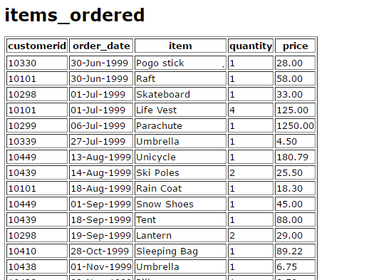

## group by 与 having
* 分组:将表格中的数据按照某一列进行分组,通常会搭配聚合函数使用,常见的聚合函数有如下几种
	* sum
	* avg
	* count
	* min max
<!--more-->
* eg
	* 存在一个表格,结构如下
		* 
		* [http://www.sqlcourse2.com/items_ordered.html](http://www.sqlcourse2.com/items_ordered.html)
	* 将订单按照customerid进行分组,并且算出每一个客户对应的订单总价
		
			select i.customerid, sum(price) 
			from items_ordered i
			group by i.customerid
			having sum(price) > 100;
	* tips:
		* 假设存在另外一个表:存放customerid以及相应的客户信息.当你想要联合查询时,一般是先join之后再进行group by的操作
		* having是在分组之后上面进行的操作,而where的操作是在原来的每一条记录上面进行操作.
		
				select i.customerid, avg(price) from items_ordered i
				where i.price > 10
				and i.price < 100
				group by i.customerid
				having sum(price) > 100;
		* 这个查询语句的意思是:在表中先找出price在10和100之间的项,将其按照customerid进行分组,在每个分组中找出总价值大于100的分组,打印出其customerid以及平均价值.
