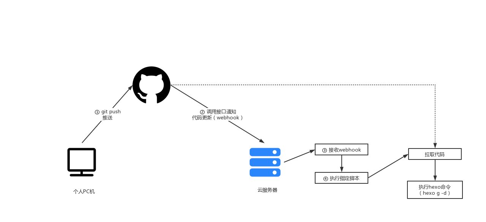

# 整体流程图




# 分步骤

## git push推送

此处略去

## 调用接口通知

此部分为最核心的部分内容，主要分为两块内容

* 在服务器上启动server，接收来自github更新时候的调用（即webhook）
* 配置github上的webhook

<!--more-->

### 启动server

1. 创建文件夹，进入文件夹执行操作

```
npm init -y // 初始化
npm i github-webhook-handler // 安装 github webhook监听工具
```

2. 在文件夹中新建文件`gitupdate.js`

* 替换password，同时记录下来，在github上配置github会使用到
* 修改deploy.sh为接收push时会执行的具体脚本

```
var http = require('http')
var createHandler = require('github-webhook-handler')
// secret:填写 github 配置的密码  path设置成 / 即可
var handler = createHandler({ path: '/', secret: 'password' })

function run_cmd(cmd, args, callback) {
  var spawn = require('child_process').spawn;
  var child = spawn(cmd, args);
  var resp = "";

  child.stdout.on('data', function(buffer) { resp += buffer.toString(); });
  child.stdout.on('end', function() { callback (resp) });
}

http.createServer(function (req, res) {
  handler(req, res, function (err) {
    // 断开请求
    console.log('请求过来了，不要走了！')
    res.statusCode = 404
    res.end('no such location')
  })
}).listen(4000,function(){
  console.log((new Date()) + '我启动起来了', 4000);
})

handler.on('error', function (err) {
  console.error('Error:', err.message)
})

handler.on('push', function (event) {
  console.log('Received a push event for %s to %s',
    event.payload.repository.name,
    event.payload.ref)
    // 监听到 push 执行 sh 文件夹
    run_cmd('sh', ['/etc/cron.daily/hexoUpdate.sh',event.payload.repository.name], function(text){ console.log(text) });
})

handler.on('issues', function (event) {
  console.log('Received an issue event for %s action=%s: #%d %s',
    event.payload.repository.name,
    event.payload.action,
    event.payload.issue.number,
    event.payload.issue.title)
})
```

3. 使用pm2来启动脚本

```
pm2 start gitupdate.js --name hexoUpdate
```

启动之后通过telnet localhost port或在本地上telnet  ip  port 验证是否创建成功

其他命令

```
pm2 list   # 查看pm2启动进程情况及id
pm2 logs  ${id}   # 查看执行进程的执行日志
pm2 stop ${id}   #关闭进程
node gitupdate.js   #直接启动命令
```


### 配置github

进入代码仓库---settings----Webhooks，添加

* Payload URL：http://ip:port/， 其中ip为云服务器的ip，port为上一步启动时的指定端口，注意由于上一步我们的`gitupdate.js`文件中的path指定为 `/`，故此处不需要额外的path路径了
* Content type：修改为application/json
* Secret：上一步的password

## 接收webhook&执行指定脚本

完成上面两步我们就可以实现往代码仓库推送代码之后，触发服务器上执行指定脚本的目的了，可以在`代码仓库---settings----Webhooks--详情---Recent Deliveries` 中查看推送记录。

参考

* [github管理项目 使用 webhooks 实现推送，服务器实时自动部署](https://blog.csdn.net/clli_Chain/article/details/120156383)

