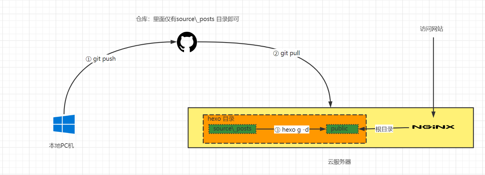

# 整體流程圖



要点说明：

* 博客的文章是以md文件的形式存放在目录  source\\_post 下的
* hexo g -d命令可以在public目录下生成网站的静态页面（html文件）
* nginx可以作为静态网站的容器

# ECS

## hexo部署并配置next主题

* [hexo官方文档](https://hexo.io/zh-cn/docs/index.html)
* [next主题官方网站](https://theme-next.js.org/)
* [next主题github地址](https://github.com/next-theme/hexo-theme-next)

<!--more-->

## nginx部署

* 安装命令较为简单

```
sudo yum -y install nginx   # 安装 nginx
```

* 默认配置文件地址为 `/etc/nginx`
* 安装完成后修改网站的根目录为hexo对应的public文件夹即可

# 本地

* [hexo官方文档](https://hexo.io/zh-cn/docs/index.html)

# 使用流程

## 本地新建文章 

在hexo目录下，使用命令`hexo new post  文章标题` 新建一篇文章，此时在source/_post目录下会看到新增了`文章标题.md`的文件，将其提交到GitHub远程仓库上

## ECS

在 服务器上，执行 `git pull`拉取post目录下新建的md文章，然后再执行`hexo g -d`即可更新public下的静态文件

## 访问

此时访问nginx页面就可以查看到新编写的文章了


