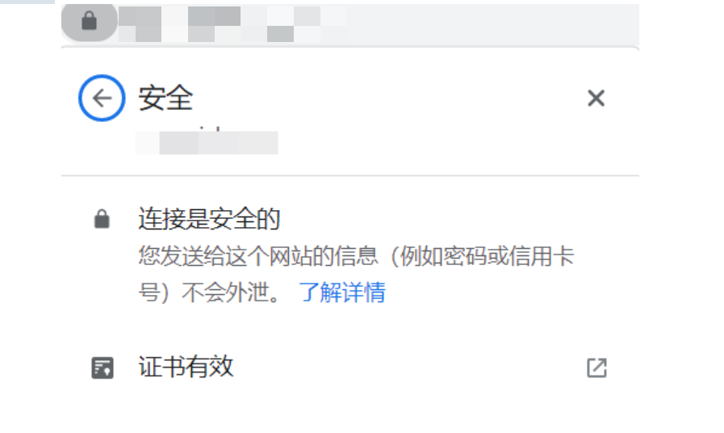

ttt
# 实现效果

<!--more-->

# 实现过程

其实很简单，就是将使用nginx的443端口，同时配置好证书的路径即可；当然前提是你已经将你得域名通过dns解析到了你的nginx是哪个，同时已经申请到了域名所对应的SSL证书

测试关联文档 [我的常用obsidian插件列表](./%E6%88%91%E7%9A%84%E5%B8%B8%E7%94%A8obsidian%E6%8F%92%E4%BB%B6%E5%88%97%E8%A1%A8.md)
# 相关文档

* [域名型（DV）免费 SSL 证书申请](https://cloud.tencent.com/document/product/400/6814)
* [Nginx 服务器 SSL 证书安装部署](https://cloud.tencent.com/document/product/400/35244)

