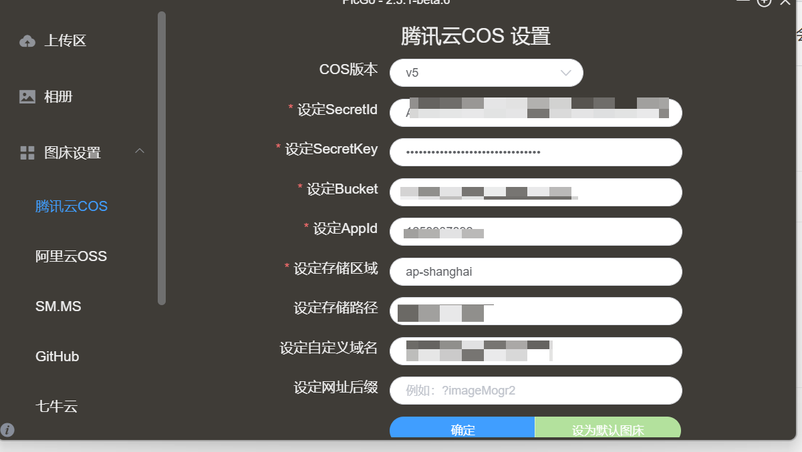
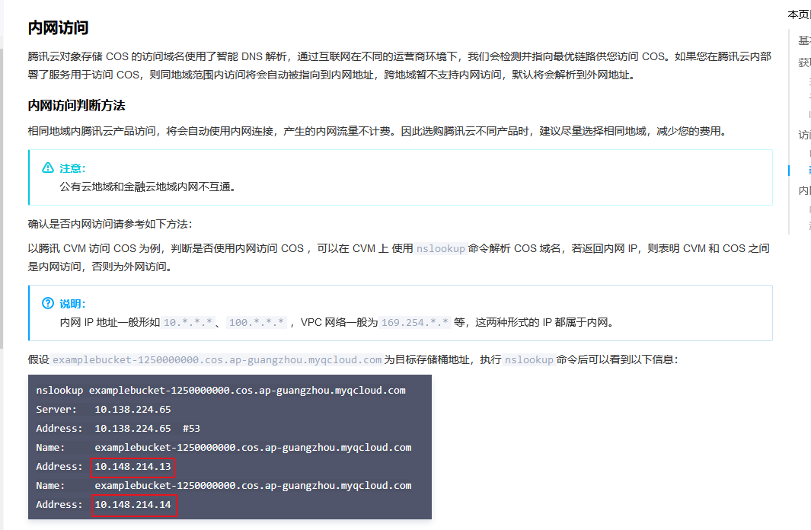

# 背景

  使用markdown时，总是需要有贴上图片的场景，一般情况下有以下几种方式可以解决：

| 实现方式                                 | 缺点                                                         |
| ---------------------------------------- | ------------------------------------------------------------ |
| 链接到本地文件                           | 发布到在线博客等的场景下不适用                               |
| 将文件转成base64                         | 较为麻烦，需要借助一些工具进行转码； 阅读上需要借助一些工具，否则会造成可读性降低 |
| 使用在线公有图床（如新浪图床、github等） | 不稳定 ，如果公有图床启用了防盗链或者其他工具的话， 会导致无法访问 |

使用腾讯云存储可以解决以上问题，唯一的缺点可能就是要收费吧

<!--more-->

# 具体流程

## 开通腾讯云COS服务

此处略去，可以参考官方文档，需要注意的是，对于我们的这个场景来说，COS主要包括以下两个资费：

* 存储费用
* 流量费用（如果你有一台腾讯云的服务器，那么可以通过服务器进行转发免除此项费用）

需要注意的是，需要将新建的bucket设置为**私有写公有读**

## 使用typora及PicGo

借助这两个工具我们可以实现图片的自动上传。

### 配置PicGo

* [下载安装地址](https://picgo.github.io/PicGo-Doc/zh/guide/)
* 根据cos上获取相关信息，其中SecretId、SecretKey和AppId在`个人中心-访问管理`可以获取，其他cos的信息可以在cos上查询获取

### 配置typora

* 在`偏好设置-图像设置`中设置PicGo.exe的路径即可

至此我们就实现了在typora上编写markdown文件时图片的自动上传

## 延伸

由于刚好有一台腾讯云服务器，而通过内网访问时不计算流量费用

所以在服务器上配置了一下nginx的反向代理就实现了通过内网访问oss图片

* 要注意服务器和cos的bucket需要属于同一个地域
* 可以通过上面图片的方式判断是否是通过内网访问

